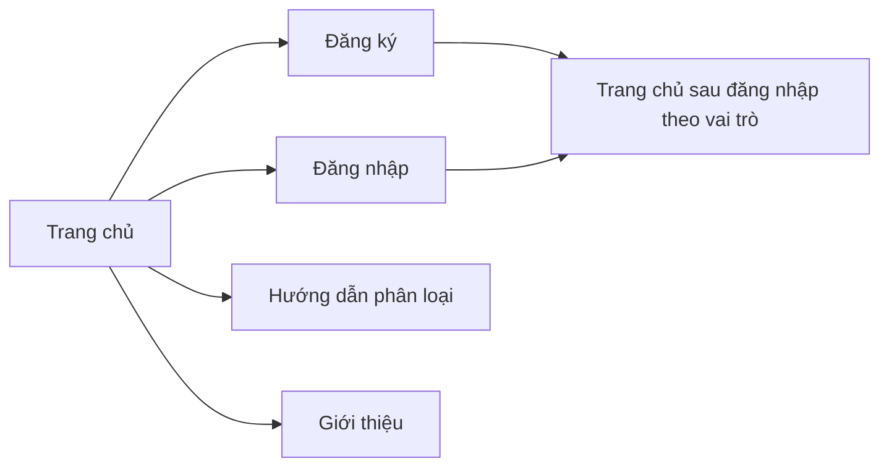

# Đặc tả giao diện — Trang chủ

**Hệ thống:** Thu gom rác tái chế thông minh tích hợp AI  
**Màn hình:** Trang chủ (public — khách vãng lai)  
**Phiên bản tài liệu:** 1.0  
**Liên kết mockup:** `mockup-trang-chu.html` (mở bằng trình duyệt)

---

## 1. Mục đích và phạm vi

| Mục đích | Giới thiệu hệ thống, dẫn hướng đăng ký/đăng nhập, truy cập nội dung công khai (hướng dẫn, giới thiệu). |
|----------|--------------------------------------------------------------------------------------------------------|
| Đối tượng sử dụng | Khách vãng lai (chưa đăng nhập). |
| Không bao gồm | Form tạo yêu cầu thu gom, bảng điểm — thực hiện sau khi đăng nhập (theo vai trò Khách hàng). |

---

## 2. Cấu trúc khối giao diện (layout)

Thứ tự từ trên xuống:

1. **Thanh nhãn mockup** (chỉ dùng trong tài liệu thiết kế, không hiển thị trên bản triển khai thật).
2. **Header (thanh điều hướng cố định theo chiều dọc trang):** logo + menu + nút Đăng nhập / Đăng ký.
3. **Hero:** tiêu đề chính, mô tả ngắn, hai CTA, khu vực minh họa (hình ảnh/banner).
4. **Khối “Vì sao chọn hệ thống?”:** 3 thẻ (card) nội dung ngang (responsive: 1 cột trên mobile).
5. **Khối “Quy trình cho khách hàng”:** 4 bước (số thứ tự + mô tả ngắn).
6. **Banner kêu gọi hành động (CTA):** nền nổi bật, một nút chính.
7. **Footer:** bản quyền, liên kết phụ (Điều khoản, Liên hệ).

---

## 3. Thành phần giao diện chi tiết

### 3.1. Header

| Thành phần | Kiểu | Hành vi / nội dung |
|------------|------|---------------------|
| Logo | Vùng nhận diện thương hiệu (icon + tên ứng dụng) | Click → về Trang chủ (`/`). |
| Menu chính | Liên kết văn bản | Trang chủ (active), Hướng dẫn phân loại, Giới thiệu — URL theo cấu hình routing. |
| Đăng nhập | Nút secondary (viền) | Điều hướng tới màn đăng nhập. |
| Đăng ký | Nút primary (nền đậm) | Điều hướng tới màn đăng ký. |

**Trạng thái:** hover làm đổi nền/chữ menu; focus visible cho bàn phím (WCAG khuyến nghị).

### 3.2. Hero

| Thành phần | Ràng buộc nội dung |
|------------|-------------------|
| Tiêu đề (H1) | Một dòng chính, thể hiện giá trị: thu gom tái chế, tiện lợi/minh bạch. |
| Đoạn lead | 1–2 câu: đặt lịch, theo dõi, tích điểm, AI (theo `detai.md`). |
| CTA chính | Văn bản kiểu “Bắt đầu — Đăng ký miễn phí” → `/register` (hoặc tương đương). |
| CTA phụ | “Xem hướng dẫn” → trang hướng dẫn phân loại. |
| Khu minh họa | Ảnh/banner hoặc illustration (gợi ý: ảnh rác + icon AI); có thể thay bằng slider sau. |

### 3.3. Khối ba thẻ (lợi ích)

Mỗi thẻ gồm: icon (hoặc placeholder), tiêu đề ngắn, mô tả 2–3 dòng.

| Thẻ | Ý nội dung (khớp nghiệp vụ) |
|-----|----------------------------|
| 1 | Đặt lịch theo địa chỉ — liên quan UC tạo yêu cầu thu gom. |
| 2 | AI gợi ý loại rác — tùy chọn upload ảnh. |
| 3 | Tích điểm & đổi thưởng — theo phần quản lý điểm/đổi thưởng. |

### 3.4. Quy trình 4 bước

Hiển thị tuần tự: (1) Đăng ký/Đăng nhập → (2) Tạo yêu cầu → (3) Theo dõi trạng thái → (4) Nhận điểm & đổi thưởng.  
Chỉ mang tính thông tin; không thay thế màn hình chi tiết từng bước.

### 3.5. CTA banner cuối

Nền màu chủ đạo (xanh lá), chữ sáng; một nút “Đăng ký ngay” trùng luồng với CTA hero.

### 3.6. Footer

Liên kết phụ và bản quyền; không bắt buộc có đầy đủ nội dung pháp lý trong mockup — bản production bổ sung theo yêu cầu triển khai.

---

## 4. Điều hướng và luồng

Sau đăng nhập thành công, hệ thống chuyển tới **trang chủ theo vai trò** (theo `luonghd.md` UC02) — giao diện trang đó có thể khác trang landing này (dashboard khách hàng / trang nhân viên / admin). Trang chủ **public** này vẫn có thể truy cập khi đã đăng nhập nếu cấu hình cho phép, với header đổi thành “Tài khoản / Đăng xuất”.

---

## 5. Biến thể khi đã đăng nhập (gợi ý triển khai)

| Thay đổi so với bản Guest | Mô tả |
|---------------------------|--------|
| Header | Thay cặp Đăng nhập/Đăng ký bằng: tên người dùng hoặc avatar, menu “Tài khoản”, “Đăng xuất”; có thể thêm shortcut “Tạo yêu cầu”, “Theo dõi”. |
| Hero CTA | “Tạo yêu cầu thu gom” (primary), “Xem yêu cầu của tôi” (secondary). |

Chi tiết màn **dashboard** có thể tách tài liệu `dac_ta_giao_dien_dashboard_khach_hang.md` nếu cần.

---

## 6. Responsive

| Ngưỡng | Hành vi |
|--------|---------|
| ≥ 900px | Hero 2 cột; ba thẻ 3 cột; bốn bước 4 cột. |
| 768px – 899px | Hero 1 cột; thẻ 1–2 cột tùy thiết kế; bước 2 cột. |
| &lt; 480px | Một cột; menu có thể thu vào nút “hamburger” (bắt buộc khi menu tràn). |

---

## 7. Màu sắc và chữ (tham số mockup)

| Token / mục đích | Giá trị gợi ý |
|------------------|----------------|
| Màu chủ (primary) | `#1b5e20` |
| Chủ nhạt | `#2e7d32` |
| Nền trang | `#f4f7f4` |
| Chữ phụ | `#5f6368` |
| Font | System UI / Segoe UI / sans-serif |

Có thể đồng bộ với design system của frontend (CSS variables).

---

## 8. Tiêu chí chấp nhận (kiểm thử giao diện)

- [ ] Đủ các khối theo mục 2 trên desktop và mobile.
- [ ] Mọi nút/liên kết trong header và CTA có đích rõ (hoặc placeholder `#` được thay bằng route thật).
- [ ] Một H1 duy nhất trên trang.
- [ ] Không hiển thị dữ liệu cá nhân trên bản Guest.
- [ ] Mockup HTML mở được offline, không phụ thuộc mạng.

---

## 9. Liên kết tài liệu nghiệp vụ

- Đặc tả use case tổng thể: `dac_ta_use_case.md`, `luonghd.md`
- Chức năng khách vãng lai: `detai.md` mục 3.1
