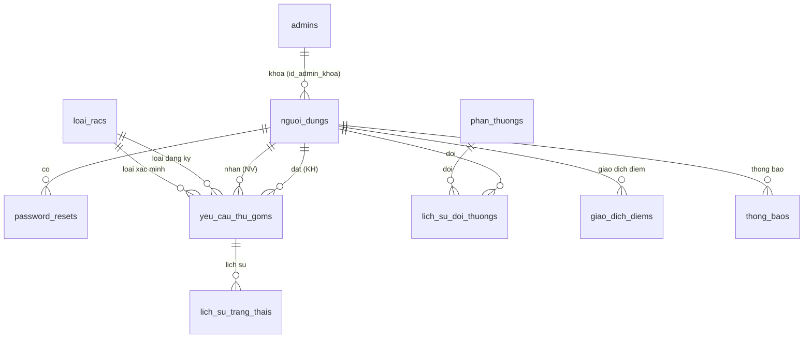

# Giải thích các bảng và mối quan hệ (CSDL thu gom rác tái chế)

Hệ thống dùng **PostgreSQL**, **10 bảng**. Phân quyền: **khách hàng / nhân viên** trong `nguoi_dungs` (cột `vai_tro`), **quản trị** trong bảng tách `admins`.

---

## 1. Từng bảng làm gì

### `admins`
Tài khoản **quản trị viên** (đăng nhập khu vực admin, quản lý người dùng, danh mục…). Tách khỏi `nguoi_dungs` để phân tách rõ đường đăng nhập và bảo mật.

### `nguoi_dungs`
Người dùng **khách hàng (CUSTOMER)** và **nhân viên (STAFF)**; lưu thông tin đăng nhập, hồ sơ, **điểm tích lũy** (`diem`), trạng thái **khóa** (`bi_khoa`). Khi admin khóa tài khoản, có thể ghi `id_admin_khoa` để biết ai khóa.

### `password_resets`
Phục vụ **quên mật khẩu**: token một lần, có hạn (`het_han`), gắn với một dòng trong `nguoi_dungs`. Sau khi đặt mật khẩu mới, token thường được xóa.

### `loai_racs`
**Danh mục loại rác** (nhựa, giấy, kim loại…): tên, mô tả, **điểm trên kg** (`diem_tren_kg`) để tính điểm khi thu gom xong, cờ `hoat_dong` để ẩn/hiện.

### `yeu_cau_thu_goms`
**Một lần thu gom**: ai đặt (`id_khach_hang`), loại rác đăng ký (`id_loai_rac`), địa chỉ, khối lượng/số lượng, ảnh (gợi ý AI), **trạng thái** (chờ / đang thu / hoàn thành / hủy), nhân viên nhận (`id_nhan_vien`), sau khi xác minh có **loại rác xác minh** (`id_loai_rac_xac_minh`), **khối lượng xác minh**, **điểm cộng** cho lần đó (`diem_tich_luy`).

### `lich_su_trang_thais`
**Nhật ký** mỗi lần trạng thái yêu cầu thay đổi (audit): phục vụ theo dõi và minh chứng luồng xử lý.

### `phan_thuongs`
**Danh mục phần thưởng** đổi bằng điểm: tên, mô tả, **điểm cần đổi** (`diem_doi`), **số lượng còn** (`so_luong_con`).

### `lich_su_doi_thuongs`
**Mỗi lần đổi thưởng thành công**: ai đổi, đổi phần thưởng nào, `diem_su_dung` (điểm trừ).

### `giao_dich_diems`
**Sổ giao dịch điểm**: tăng (sau thu gom), giảm (đổi thưởng), hoặc chỉnh tay (admin). `loai` phân biệt `earn` / `redeem` / `admin_adjust`; `id_tham_chieu` trỏ mềm tới id yêu cầu hoặc id đổi thưởng tùy nghiệp vụ.

### `thong_baos`
**Thông báo** cho người dùng (ví dụ sau khi thu gom xong): tiêu đề, nội dung, đã đọc chưa; `id_tham_chieu` có thể gắn `id_yeu_cau` để mở chi tiết.

---

## 2. Vì sao có quan hệ 1–1, 1–n, n–n?

Trong mô hình quan hệ (ER → bảng SQL), người ta phân loại **bản số** (cardinality) để thiết kế đúng chỗ đặt **khóa ngoại** hoặc **bảng trung gian**.

### 2.1. Quan hệ một–một (1 : 1)

**Ý nghĩa:** Mỗi bản ghi ở bảng A **tương ứng tối đa một** bản ghi ở bảng B, và ngược lại.

**Vì sao dùng:** Tách dữ liệu (ví dụ phần nhạy cảm), giảm kích thước bảng hay tách theo tần suất truy cập. Khi triển khai, thường đặt **khóa ngoại + UNIQUE** ở một phía để đảm bảo không vượt quá 1.

**Trong đồ án này:** Không tách bảng kiểu “hồ sơ mở rộng 1–1” — thông tin user gộp trong `nguoi_dungs`. Nếu sau này thêm bảng `thong_tin_chi_tiet` chỉ có **một dòng / một user**, đó là quan hệ **1–1** với `nguoi_dungs`.

---

### 2.2. Quan hệ một–nhiều (1 : n)

**Ý nghĩa:** Một bản ghi bên **một** (phía “1”) **liên kết với nhiều** bản ghi bên **nhiều** (phía “n”). Phía “nhiều” mang **khóa ngoại** trỏ về phía “một”.

**Vì sao:** Đây là dạng **phổ biến nhất**. Một thực thể “cha / danh mục” được nhiều thực thể “con / giao dịch” tham chiếu.

**Ví dụ trong CSDL của bạn:**

| Phía “1” | Phía “n” | Giải thích ngắn |
|----------|----------|------------------|
| `loai_racs` | `yeu_cau_thu_goms` (theo `id_loai_rac`) | Một loại rác xuất hiện ở **nhiều** yêu cầu; mỗi yêu cầu chỉ chọn **một** loại chính (lúc đăng ký). |
| `yeu_cau_thu_goms` | `lich_su_trang_thais` | Một yêu cầu có **nhiều** dòng lịch sử trạng thái theo thời gian. |
| `nguoi_dungs` | `yeu_cau_thu_goms` (`id_khach_hang`) | Một khách tạo **nhiều** yêu cầu. |
| `nguoi_dungs` | `giao_dich_diems`, `thong_baos`, `password_resets` | Một user có **nhiều** giao dịch điểm / thông báo / token reset. |
| `phan_thuongs` | `lich_su_doi_thuongs` | Một loại phần thưởng xuất hiện trong **nhiều** lần đổi (bởi nhiều user khác nhau). |
| `admins` | `nguoi_dungs` (`id_admin_khoa`) | Một admin có thể là người khóa **nhiều** tài khoản (ghi nhận phía user). |

---

### 2.3. Quan hệ nhiều–nhiều (n : n)

**Ý nghĩa:** Một bản ghi bên A có thể gắn với **nhiều** bản ghi bên B, và **một** bản ghi bên B cũng gắn với **nhiều** bản ghi bên A.

**Vì sao không gắn trực tiếp một khóa ngoại:** Nếu chỉ đặt FK từ A → B thì mỗi dòng A chỉ trỏ được **một** B; không đủ. Cần **bảng trung gian** (junction / associative): mỗi dòng là một “cặp” (A, B) kèm thuộc tính giao dịch (số lượng, thời điểm…).

**Trong đồ án này:**

- **Yêu cầu ↔ loại rác (đăng ký):** Thiết kế hiện tại là **1 : n** — mỗi `yeu_cau_thu_goms` có **một** `id_loai_rac` chính. Nếu nghiệp vụ đổi thành “một yêu cầu gồm **nhiều** loại rác, mỗi loại một khối lượng”, khi đó **mới** cần bảng trung gian (ví dụ `yeu_cau_loai_racs`) — lúc đó quan hệ giữa `yeu_cau_thu_goms` và `loai_racs` trở thành **n : n** qua bảng đó.

- **Người dùng ↔ phần thưởng:** Một khách đổi **nhiều** loại quà theo thời gian; một loại quà được **nhiều** khách đổi. Đây là **n : n**. Không lưu trực tiếp hai mảng khóa trong một bảng, mà dùng bảng giao dịch **`lich_su_doi_thuongs`**: mỗi dòng là một lần “nối” user + phần thưởng + điểm trừ — đóng vai **bảng trung gian** của quan hệ n–n (còn gọi là thực thể liên kết / association).

---

## 3. Mối quan hệ (kết nối)

Tóm tắt bằng **khóa ngoại** trong `db/schema.sql`:

| Bảng | Kết nối tới | Ý nghĩa |
|------|-------------|--------|
| `nguoi_dungs` | `admins` (`id_admin_khoa` → `admins.id`) | Tài khoản bị khóa bởi admin nào (nếu có). |
| `password_resets` | `nguoi_dungs` | Token reset thuộc user nào. |
| `yeu_cau_thu_goms` | `nguoi_dungs` (`id_khach_hang`) | Khách đặt yêu cầu. |
| `yeu_cau_thu_goms` | `nguoi_dungs` (`id_nhan_vien`) | NV nhận xử lý (có thể NULL lúc chưa nhận). |
| `yeu_cau_thu_goms` | `loai_racs` (`id_loai_rac`) | Loại rác khách chọn / AI gợi ý. |
| `yeu_cau_thu_goms` | `loai_racs` (`id_loai_rac_xac_minh`) | Loại sau khi NV xác minh (có thể NULL). |
| `lich_su_trang_thais` | `yeu_cau_thu_goms` | Mỗi dòng thuộc một yêu cầu. |
| `lich_su_doi_thuongs` | `nguoi_dungs`, `phan_thuongs` | Một lần đổi: một user, một phần thưởng. |
| `giao_dich_diems` | `nguoi_dungs` | Mọi biến động điểm của user. |
| `thong_baos` | `nguoi_dungs` | Thông báo gửi cho user nào. |

**Không có khóa ngoại cứng** tới `yeu_cau`/`lich_su_doi` trong `id_tham_chieu` của `giao_dich_diems` / `thong_baos` — để linh hoạt nhiều loại tham chiếu; ràng buộc do **ứng dụng** đảm bảo.

---

## 4. Sơ đồ quan hệ (tổng quan)

---

## 5. Luồng dữ liệu (dễ nhớ)

1. **Đăng ký / đăng nhập** → `nguoi_dungs` (và `admins` cho quản trị).  
2. **Quên MK** → `password_resets` + cập nhật `nguoi_dungs`  
3. **Tạo yêu cầu** → `yeu_cau_thu_goms` (trỏ `loai_racs`), ghi `lich_su_trang_thais` khi đổi trạng thái.  
4. **Thu gom xong** → cập nhật yêu cầu, cộng điểm → `giao_dich_diems` (earn), `nguoi_dungs.diem`.  
5. **Đổi thưởng** → `lich_su_doi_thuongs`, `giao_dich_diems` (redeem), trừ `phan_thuongs.so_luong_con` và `nguoi_dungs.diem`.  
6. **Thông báo** → `thong_baos`.

---

*Tài liệu khớp `db/schema.sql` và `db/schema_dbdiagram.dbml`.*
