# Biểu đồ tuần tự — 16 use case (`dac_ta_use_case.md`)

**Chuẩn dùng chung:** `Actor` (theo UC) → **Form** (giao diện) → **Control** (xử lý) → **CSDL** (lưu trữ).  
Sao chép **từng khối** `@startuml` … `@enduml` dán vào [plantuml.com](https://www.plantuml.com/plantuml/uml) để xuất PNG/SVG.

**File gộp 16 sơ đồ:** `so-do-tuan-tu-16-use-case-all.puml` (mở bằng VS Code + PlantUML để xem lần lượt). Trên plantuml.com nên **dán từng UC** (một `@startuml` mỗi lần).

---

## UC01 – Đăng ký

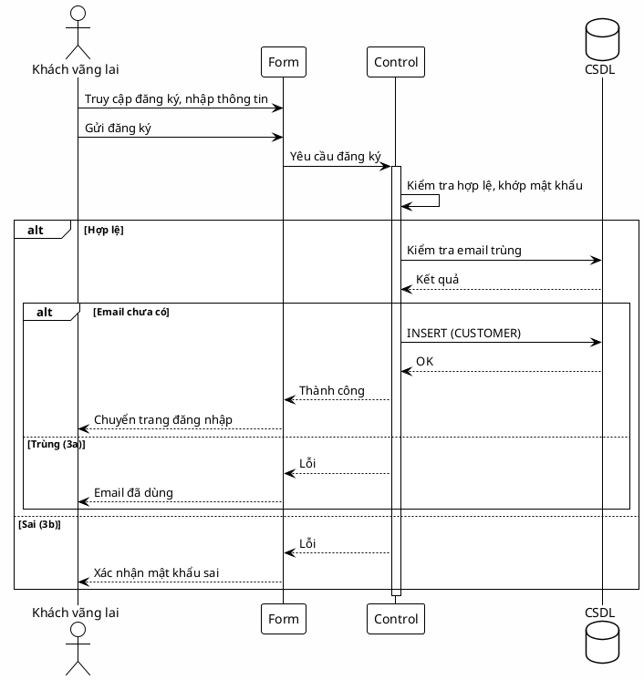

---

## UC02 – Đăng nhập

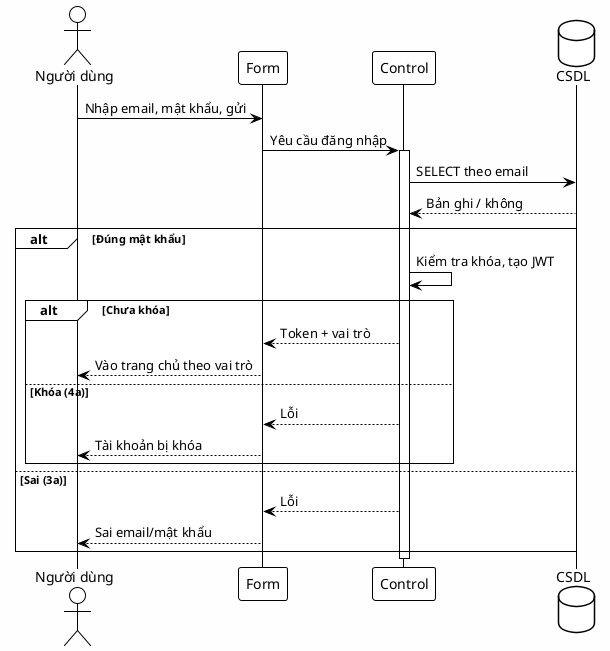

---

## UC03 – Quản lý tài khoản cá nhân

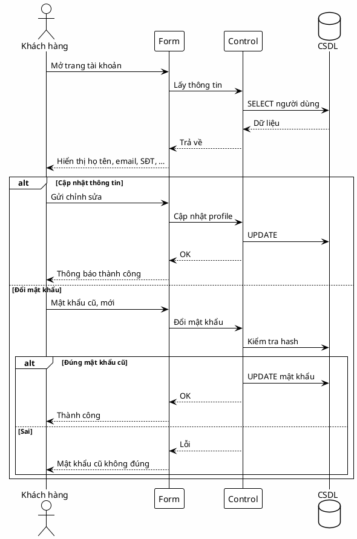

---

## UC04 – Tạo yêu cầu thu gom

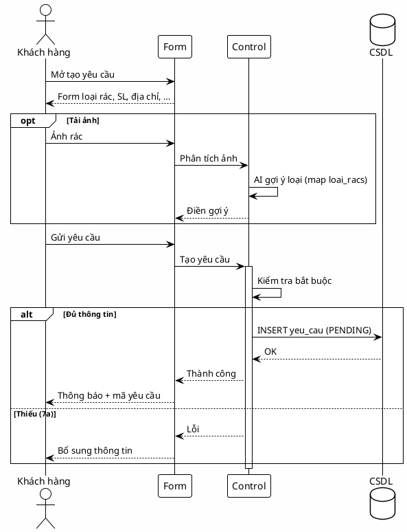

---

## UC05 – Theo dõi trạng thái

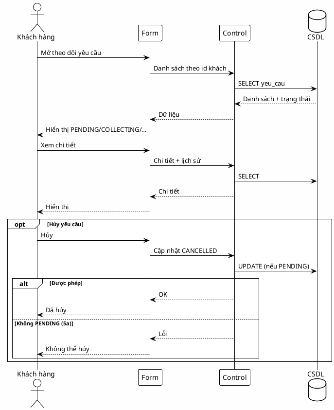

---

## UC06 – Xem điểm

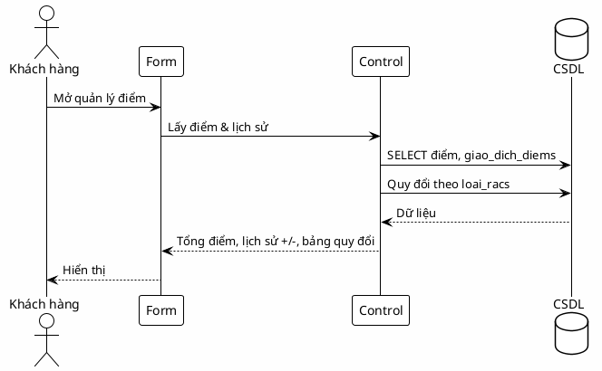

---

## UC07 – Đổi thưởng

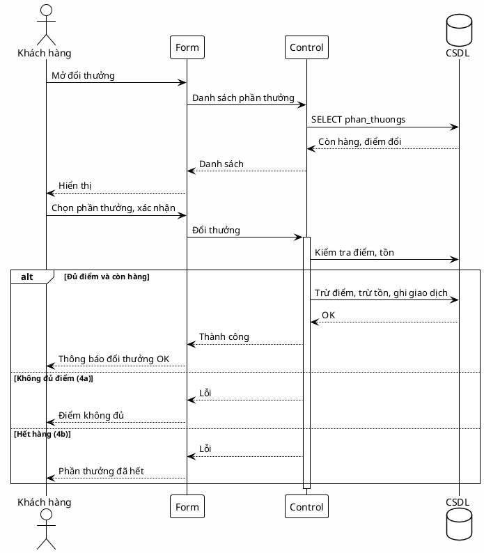

---

## UC08 – Thống kê (khách hàng)

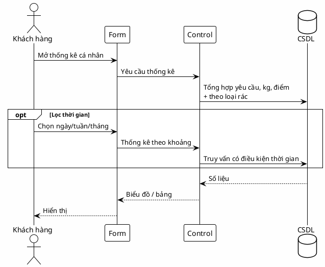

---

## UC09 – Xem và nhận yêu cầu (nhân viên)

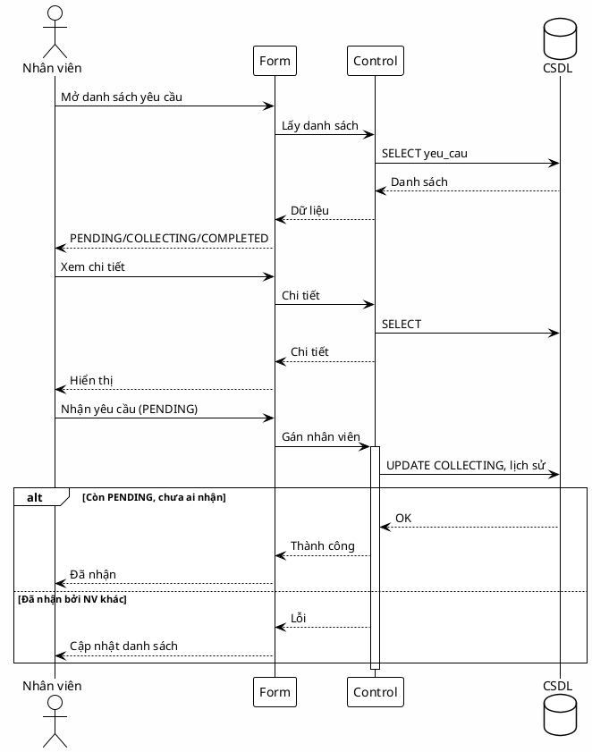

---

## UC10 – Thu gom và xác minh

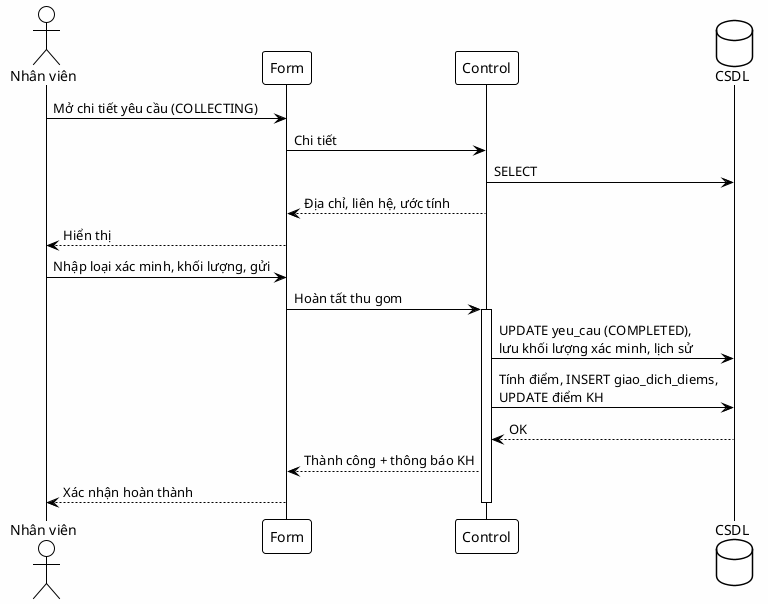

---

## UC11 – Quên mật khẩu

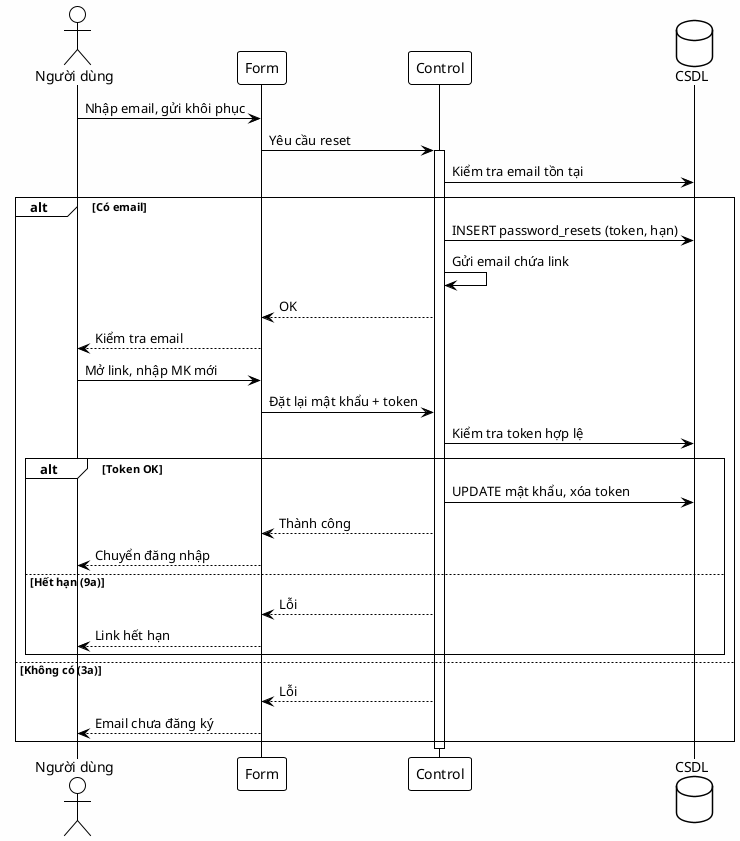

---

## UC12 – Thống kê và báo cáo (nhân viên)

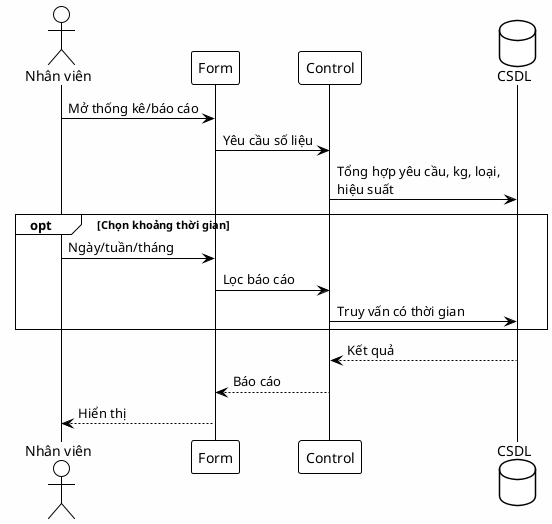

---

## UC13 – Quản lý người dùng (Admin)

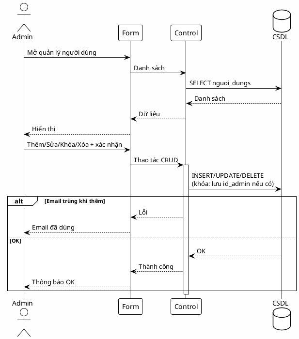

---

## UC14 – Quản lý loại rác

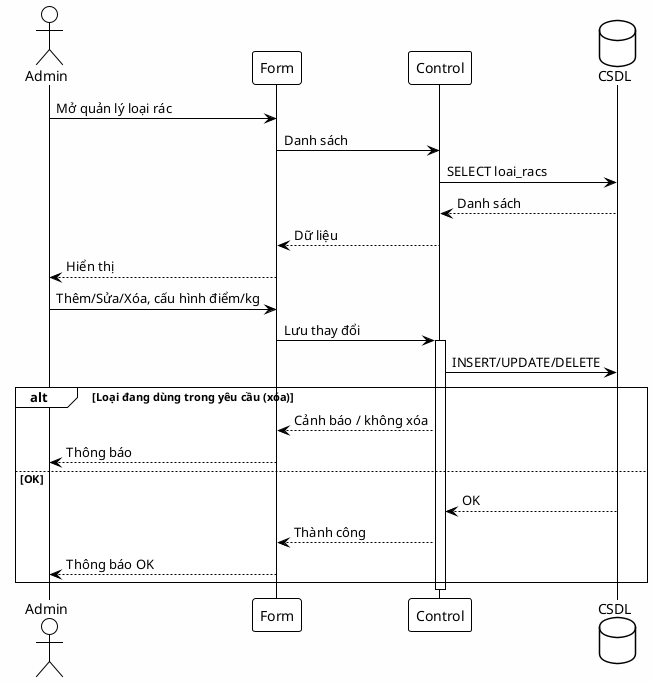

---

## UC15 – Quản lý phân quyền

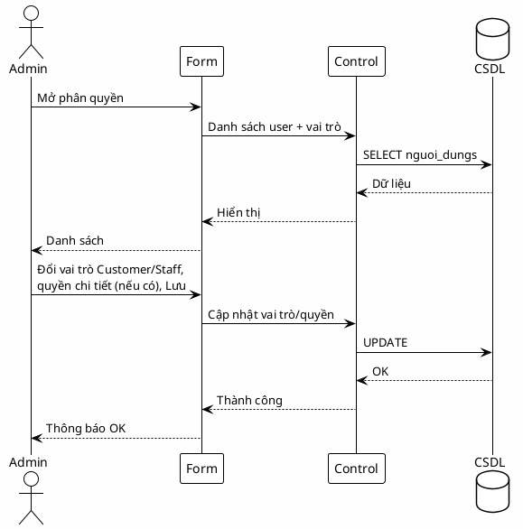

---

## UC16 – Quản lý phần thưởng

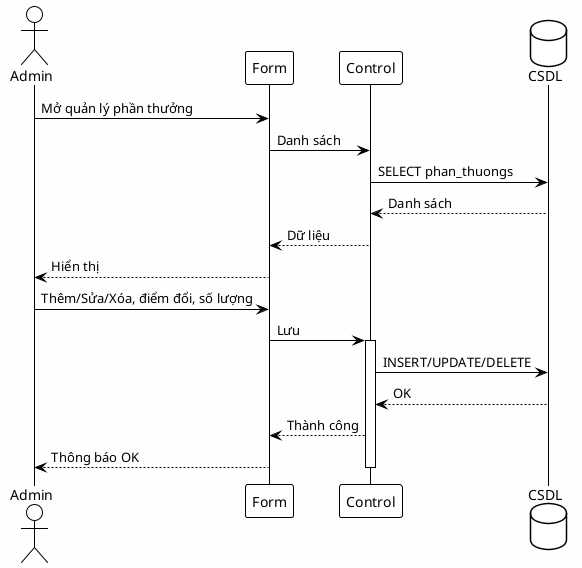

---

*Tham chiếu: `docs/dac_ta_use_case.md` — UC01–UC16.*
