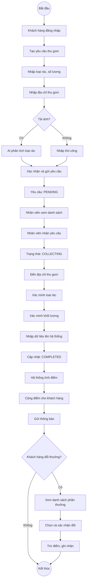
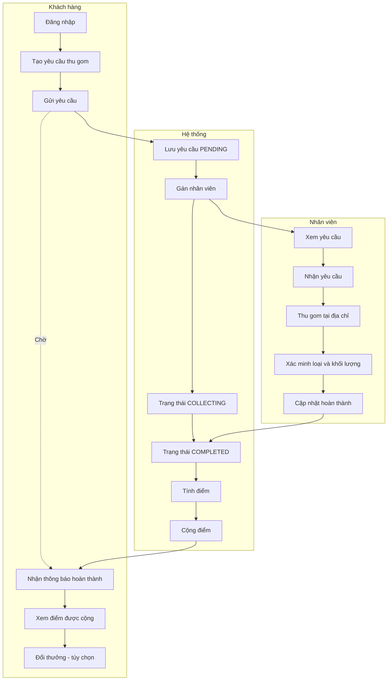
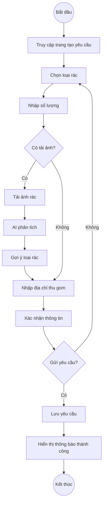

# SƠ ĐỒ HOẠT ĐỘNG - HỆ THỐNG THU GOM RÁC TÁI CHẾ THÔNG MINH

## Luồng hoạt động chính (Tạo yêu cầu → Thu gom → Tích điểm → Đổi thưởng)

## Sơ đồ dạng Swimlane (Phân tách theo tác nhân)

## Luồng chi tiết - Tạo yêu cầu thu gom

