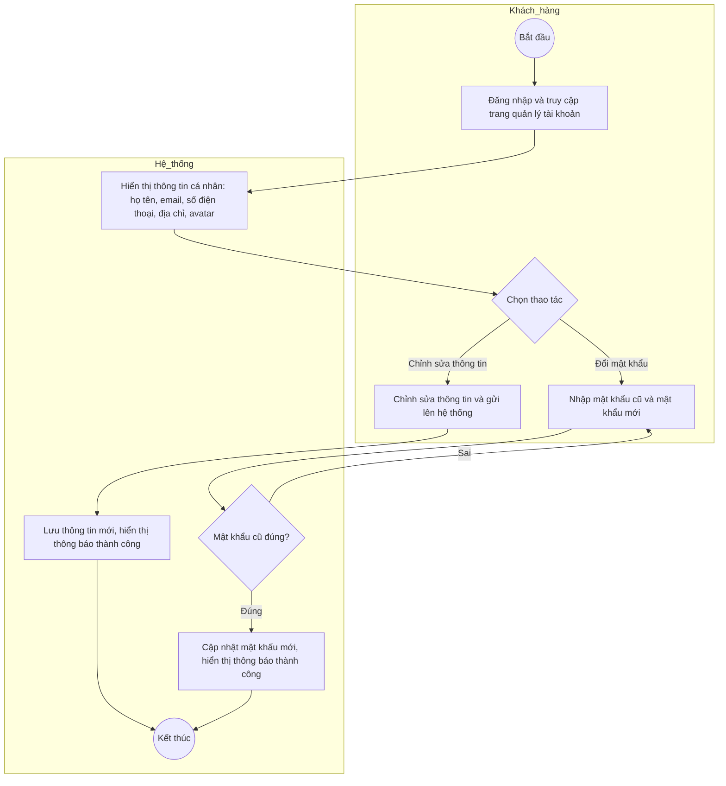

# Sơ đồ hoạt động - Quản lý tài khoản cá nhân (UC03)

*Đúng theo đặc tả trong dac_ta_use_case.md*

## Luồng chi tiết từ đặc tả

| Bước | Hành động của tác nhân (Khách hàng) | Phản ứng của hệ thống |
|------|-----------------------------------|------------------------|
| 1 | Đăng nhập và truy cập trang quản lý tài khoản | - |
| - | - | 2. Hiển thị thông tin cá nhân hiện tại (họ tên, email, số điện thoại, địa chỉ, avatar) |
| 3a | Chỉnh sửa thông tin và gửi lên hệ thống | 4a. Lưu thông tin mới, hiển thị thông báo thành công |
| 3b | Chọn đổi mật khẩu, nhập mật khẩu cũ và mật khẩu mới | 4b. Kiểm tra mật khẩu cũ đúng, cập nhật mật khẩu mới |
| - | - | 5. Kết thúc Use case |

**Luồng thay thế:** Mật khẩu cũ sai → Hiển thị lỗi, yêu cầu nhập lại.

---

## Mermaid Activity Diagram

---

## Tóm tắt luồng

1. **Khách hàng** đăng nhập, truy cập trang quản lý tài khoản.
2. **Hệ thống** hiển thị thông tin hiện tại (họ tên, email, SĐT, địa chỉ, avatar).
3. **Khách hàng** chọn:
   - **3a** Chỉnh sửa thông tin → Gửi → **Hệ thống** lưu, hiển thị thành công → Kết thúc.
   - **3b** Đổi mật khẩu → Nhập mật khẩu cũ + mới → **Hệ thống** kiểm tra mật khẩu cũ:
     - **Sai** → Hiển thị lỗi, quay lại nhập.
     - **Đúng** → Cập nhật mật khẩu mới → Hiển thị thành công → Kết thúc.
