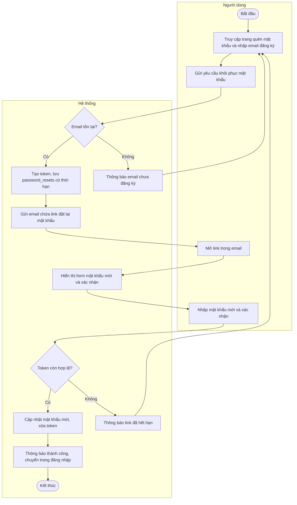

# Sơ đồ hoạt động - Quên mật khẩu

Bản **đầy đủ bước UC11**, cùng kiểu swimlane với `so-do-hoat-dong-dang-nhap`:

- **Mermaid:** `docs/so-do-hoat-dong-quen-mat-khau.mmd` (dán vào [mermaid.live](https://mermaid.live))
- **PlantUML:** `docs/so-do-hoat-dong-quen-mat-khau.puml` (VS Code + PlantUML / [plantuml.com](https://www.plantuml.com/plantuml))

## Mermaid (bản khớp file .mmd)

## Bảng đặc tả (Hành động tác nhân / Phản ứng hệ thống)

| Hành động của tác nhân | Phản ứng của hệ thống |
| :--- | :--- |
| 1. Truy cập trang quên mật khẩu và nhập email đăng ký. | - |
| 2. Gửi yêu cầu khôi phục mật khẩu. | - |
| - | 3. Kiểm tra email tồn tại trong hệ thống. |
| - | 4. Tạo token đặt lại mật khẩu, lưu vào bảng password_resets với thời hạn. |
| - | 5. Gửi email chứa link đặt lại mật khẩu đến email người dùng. |
| 6. Mở link trong email (trước khi hết hạn). | - |
| - | 7. Hiển thị form nhập mật khẩu mới và xác nhận mật khẩu. |
| 8. Nhập mật khẩu mới và xác nhận. | - |
| - | 9. Kiểm tra token còn hợp lệ. |
| - | 10. Cập nhật mật khẩu mới, xóa token. |
| - | 11. Hiển thị thông báo thành công, chuyển đến trang đăng nhập. |
| - | 12. Kết thúc Use case. |

**Luồng thay thế:** Email không tồn tại → thông báo *email chưa đăng ký*, quay lại nhập email. Token hết hạn → thông báo *link đã hết hạn*, gửi lại yêu cầu quên mật khẩu.
