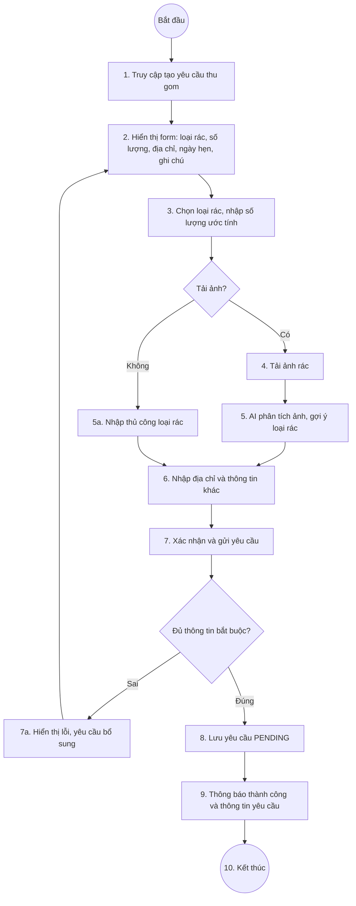

# Sơ đồ hoạt động — Tạo yêu cầu thu gom (UC04)

## File sơ đồ chuẩn (SVG, màu đồng nhất Đăng nhập)

Mở trong trình duyệt: **`so_do_tao_yeu_cau_thu_gom.html`**

- Nền trắng, viền `#87CEEB`, mũi tên `#1976D2`
- Hai swimlane: **Khách hàng** | **Hệ thống**
- Luồng khớp bảng đặc tả (bước 1–10)

---

## Mermaid (tham khảo)

---

## Bảng đặc tả (tham chiếu)

| Bước | Khách hàng | Hệ thống |
|------|------------|----------|
| 1 | Truy cập chức năng tạo yêu cầu thu gom | |
| 2 | | Hiển thị form |
| 3 | Chọn loại rác, nhập số lượng | |
| 4–5 | Tải ảnh (tùy chọn) | AI phân tích (khi có ảnh) |
| 5a | Nhập thủ công loại rác (khi không ảnh) | |
| 6 | Nhập địa chỉ thu gom và thông tin khác | |
| 7 | Xác nhận và gửi | Kiểm tra |
| 7a | | Thiếu thông tin → lỗi → quay form bước 2 |
| 8–10 | | Lưu PENDING → Thông báo → Kết thúc |
